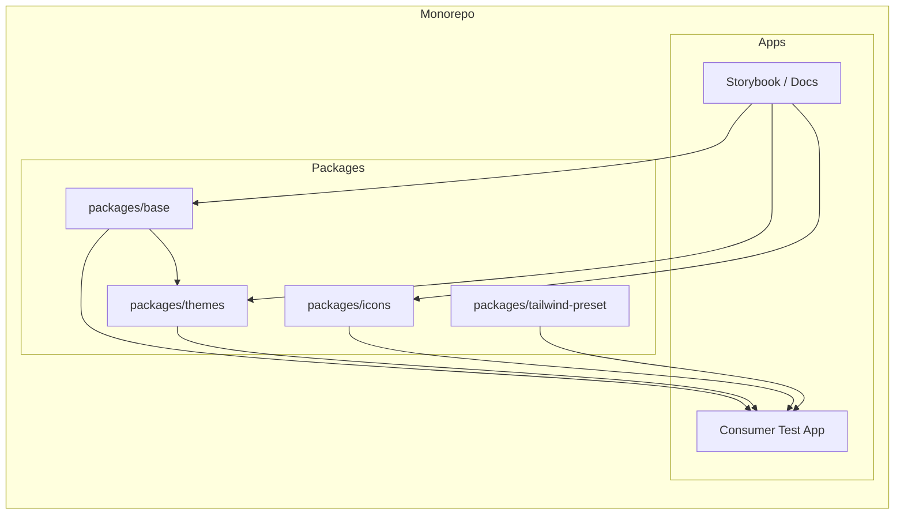

# UI Library System – From Scratch to Production

**Overview:** Build a production-grade, tutorial-documented React UI library in a PNPM + Turborepo monorepo. Each step is a reusable, article-ready tutorial; we build progressively (e.g. one Button end-to-end first) and document every design choice so the repo is a learning reference from empty repo to npm.

**Contents:** 1 Problem · 2 Goals · 3 Market and solution comparison (shadcn, Base UI, Radix, Tailwind) · 4 Theming strategy · 5 Exercise mindset · 6 Documentation model · 7 Reproducible environment · 8 Architecture · 9 Tooling · 10 Package layout · 11 Tutorial step order · **12 Dev step plan (iterations 0 to n)** · 13 Future branches · 14 Decisions · 15 Next move

---

## 1. Problem (what we're solving)

- **Need**: A React UI library that is production-ready, small to load, and fully customizable—with clear learning path from empty repo to published npm.
- **Pain points**: Many solutions are either heavy (full framework), copy-paste only (no single dependency), or opaque (hard to see why choices were made). We want a **pick-and-choose** library with **minimal default load** (flat / Material / animated as optional themes) and **documented design choices** at every step.
- **Outcome**: By the end, we have a publishable library plus a **long set of article-ready tutorials** so we (and others) can revisit each practice. The repo is the source of truth for "what we built and why."

---

## 2. Goals (summary)

- **Deliverables**: A multi-package UI library (base components, themes, icons, Tailwind integration) that is small, customizable, and pick-and-choose.
- **Process**: Every step is a **tutorial document** (tools, why, options, choice, example, links, building block).
- **Quality**: Production-ready tooling; automated tasks run against a **consumer app** and must pass.
- **Learning**: Support future branches (e.g. Vite or Turbopack variants) and expansion (animated SVG icons, etc.).
- **Payload**: Keep **bundle payload** small and tree-shakeable. (Payload CMS can be a later phase if needed.)

---

## 3. Market and solution comparison (design choices)

We compare existing options so our **design choices** are explicit. Each row is a dimension; we state what we're choosing and why.

### 3.1 Primitive / component layer

| Option | What it is | Pros | Cons | Our choice |
|--------|------------|------|------|------------|
| **Radix UI** | Headless, accessible primitives (dialog, dropdown, etc.). Multiple npm packages. | Strong a11y, composition, widely used. | Many packages; maintenance slowed post–WorkOS; some long-open issues. | **Alternative** – document why we prefer Base UI for new work. |
| **Base UI** | Single-package headless primitives (MUI/Radix lineage). Render-prop API. | One package, broad coverage, active maintenance, clear API. | Newer ecosystem than Radix. | **Chosen** – cutting edge, single dep, good for "base" package. |
| **Headless UI** | Unstyled, accessible components (Tailwind Labs). | Good a11y, Tailwind-friendly. | Smaller component set than Radix/Base UI. | Consider for specific components if needed. |

**Design choice:** Base UI as the primitive layer for `packages/base`. Radix remains a valid alternative; we document "Base UI vs Radix" in the headless-primitives step.

### 3.2 Styling and theming

| Option | What it is | Pros | Cons | Our choice |
|--------|------------|------|------|------------|
| **Tailwind CSS** | Utility-first CSS. | Small production CSS, design tokens via config, no runtime. | Consumers must use Tailwind or we ship a preset. | **Chosen** – styling via Tailwind + design tokens; minimal load when consumer uses preset. |
| **CSS-in-JS (styled-components, etc.)** | Runtime or build-time CSS-in-JS. | Scoped styles, dynamic. | Runtime cost, bundle size, RSC considerations. | Not chosen for default; optional if a theme needs it. |
| **Plain CSS / CSS variables** | Global or scoped CSS with custom properties. | No runtime, works everywhere. | Theming is manual. | **Chosen** – design tokens as CSS variables; themes set variables. |
| **shadcn/ui** | Copy-paste components (Radix + Tailwind). Not an npm dependency. | Full control, no version lock. | No single package; you own the code. | **Reference** – we adopt "primitives + Tailwind" but ship as installable packages for consistency and versioning. |

**Design choice:** Tailwind + design tokens (CSS variables). Base has no default theme; themes (flat, Material, animated) are optional layers so load stays minimal.

### 3.3 Distribution model

| Option | What it is | Pros | Cons | Our choice |
|--------|------------|------|------|------------|
| **npm package(s)** | Install via `npm install @scope/button`. | Versioning, semver, tree-shaking. | We maintain and publish. | **Chosen** – scoped packages, e.g. `@anu-ui/base`, `@anu-ui/themes`. |
| **Copy-paste (shadcn)** | Clone components into your repo. | No dependency, full control. | No single version; upgrades are manual. | Not chosen – we want one source of truth and learn publishing. |
| **CDN / single bundle** | One script tag. | Simple for small apps. | No tree-shaking, less flexible. | Not chosen. |

**Design choice:** Publish as npm packages (monorepo, Changesets). Consumers install only the packages they need.

### 3.4 Summary: how we compare to shadcn, Base UI, Radix, Tailwind

- **vs shadcn:** We use a similar stack (primitives + Tailwind) but **ship as packages** and document the full path (repo → npm). shadcn is copy-paste; we are installable + versioned.
- **vs Base UI only:** Base UI is our **primitive layer**. We add **themes** (flat, Material, animated), **icons**, and **Tailwind preset** on top so consumers get a full system with minimal load.
- **vs Radix:** We prefer Base UI for new work (single package, active maintenance). We document the comparison; Radix is still an option if we switch.
- **vs Tailwind alone:** Tailwind is our **styling mechanism**. We provide a **preset** and **themed components** that consume tokens so you get consistency and small config without building everything from utilities.

---

## 4. Theming strategy (flat, Material, animated, minimal load)

- **Base:** Headless only (Base UI). No default theme; components read **design tokens** (e.g. CSS variables).
- **Themes (optional, pick one or compose):**
  - **Flat** – minimal: solid colors, little/no shadow, clean. Smallest CSS footprint. Default "minimal" theme.
  - **Material** – optional: elevation, ripples, Material-style tokens. Separate entry/package so only consumers who want it load it.
  - **Animated / motion** – optional layer: transitions, micro-interactions. Separate so "no animation" = zero motion code in the bundle.
- **Delivery:** Separate theme packages or subpath exports (e.g. `@anu-ui/theme-flat`, `@anu-ui/theme-material`, `@anu-ui/motion`). Consumer installs base + one theme = minimal UI load. Animation is additive on top of flat or Material.

---

## 5. Exercise mindset and progressive delivery

This project is an **exercise** to understand every nut and bolt from **empty repo to published npm package**. We do **not** build everything at once.

- **Progressive build**: Start with the smallest useful slice—e.g. a **single Button**—and take it all the way: monorepo, package, build, publish, consumer app, automation. Then add the next component or package in the same way.
- **One thing at a time**: Each phase adds one building block (e.g. Button in `packages/base`, then Button in Storybook, then Button in consumer app). By the end we have a long set of **article-ready phases** you can revisit to relearn each practice.
- **Revisit-friendly**: When you open this repo in Cursor (or VS Code / WebStorm) later, the docs and in-repo comments should let you quickly see what we did and why—without re-reading external articles.

---

## 6. Documentation model (tutorial per step, article-ready)

Each building block gets a **step document** in `docs/steps/`. The bar: **any step doc can become a standalone article**. Every doc includes:

- **Goal** – What this step achieves (one paragraph).
- **Options considered** – What alternatives exist (e.g. npm vs pnpm, Volta vs mise vs .nvmrc).
- **Choice and why** – What we chose and the reasoning (so we don't forget when we revisit).
- **Tools** – Exact tools and versions.
- **Example** – Minimal code or config snippet.
- **Line-/block-level why** – Where it helps, explain why we added a specific line or config block (in the doc or as short comments in code).
- **Diagrams** – Where it clarifies: flow (e.g. repo → package → consumer), or how the end user sees it (install, import, render).
- **Relevant links** – Official docs, articles.
- **Building block** – How this step plugs into the next (e.g. feeds into Step N).

Naming: `01-reproducible-environment.md`, `02-monorepo-setup.md`, etc., so order is clear and the repo tells the story from start to finish.

**Cross-cutting rule**: From the very first step (e.g. pnpm init), we document what we did, what other options we had, and why we chose this. Same for monorepo layout, multi-package advantages, how consumers install and use the package, and how end users see the result—with diagrams where useful.

---

## 7. Reproducible environment (files in repo, zero setup drift)

A critical goal: **no "I cloned and I'm on a different Node/package manager"**. We save effort by putting **standard files in the repo** so that when a developer opens it in **VS Code, WebStorm, or Cursor**, the environment is consistent without extra instructions.

**Options we document and choose from:**

- **Volta**: Pins Node (and optionally pnpm/yarn) in `package.json` under a `"volta"` field. When the developer has Volta installed, entering the project directory automatically switches to the pinned versions. No separate version file; tool is project-aware.
- **mise** (formerly rtx): Uses a file such as `.mise.toml` or `.tool-versions` in the repo to specify Node (and other runtimes). Editors can use the specified Node when running scripts or terminals if they support it or via extensions.
- **.nvmrc** (or **.node-version**): Only specifies the Node version. Used by nvm, fnm, mise. Cursor/VS Code can "Use Version" or rely on shell integration so `node` in the terminal matches. Package manager (pnpm) is then ensured via **corepack** (e.g. `corepack enable` + pnpm version in `packageManager` in `package.json`).

The **first tutorial step** will list these options, pick one (e.g. Volta or .nvmrc + corepack), and add the chosen file(s) to the repo—with a short diagram or table of "what happens when you open the repo" so it's clear how we avoid version drift.

---

## 8. High-level architecture



- **packages/base**: Headless primitives (Base UI), minimal styling, maximum flexibility.
- **packages/themes**: One or more themes (e.g. default, minimal) that depend on `base` and apply tokens/styles.
- **packages/icons**: Icon set (e.g. SVG React components, optionally animated); tree-shakeable.
- **packages/tailwind-preset**: Shared Tailwind config (colors, spacing, components) so consumers get consistent styling and small config.
- **apps/docs**: Storybook for all packages (documentation + visual testing).
- **apps/consumer**: Real app (e.g. Vite + React or Next.js) that imports from all packages; target for E2E and "does it work in a real app" checks.

---

## 9. Tooling and technology choices

### 9.1 Monorepo and package management

- **PNPM** workspaces + **Turborepo** for tasks and caching (aligns with your preference and current best practice).
- **Tutorial step**: Monorepo setup with PNPM and Turborepo (workspace layout, `pnpm-workspace.yaml`, `turbo.json`, root scripts).

### 9.2 Developer environment (zero-friction setup)

- **Node version**: Pin with **Volta** (`volta pin node@20`) in root `package.json` so anyone with Volta gets the right Node (and optionally pnpm) without manual installs.
- **Alternative**: `.nvmrc` + **corepack** to enable pnpm; document in the same tutorial.
- **Tutorial step**: Reproducible dev environment (Volta / .nvmrc + corepack).

### 9.3 Package creation and publishing to npm

- **Publishing**: Standard npm publish with **scoped package** (e.g. `@anu-ui/base`, `@anu-ui/themes`).
- **Versioning and changelog**: **Changesets** (add → version → publish); CI runs `changeset version` and `pnpm publish -r` (or GitHub Action).
- **Tutorial steps**: Creating a publishable package (exports, main/module/types, no bundling yet); Versioning and publishing with Changesets (single package then monorepo).

### 9.4 React primitives (headless components)

- **Base UI** is the current gold standard for new work (single package, broad coverage, active maintenance, render-prop API). **Radix** remains valid and widely used; we document "why we chose Base UI" in a step.
- **Tutorial step**: Choosing and integrating headless primitives (Base UI vs Radix, installation, first component).

### 9.5 Building the library packages

- **Bundling**: **tsup** (ESM + CJS + types, esbuild, simple config) is common; externalize React/React-DOM. Alternative: unbuild or tsdown if aligning with the latest successor narrative.
- **Tutorial step**: Building a React library (tsup, dual ESM/CJS, externals, outputs).

### 9.6 Styling and theming

- **Tailwind CSS** for styling; **design tokens** (e.g. CSS variables or JS/JSON tokens) so themes and Tailwind preset stay in sync.
- **Tutorial step**: Design tokens and Tailwind preset package (structure, consuming in themes and consumer).

### 9.7 Storybook

- **Storybook** (latest stable) for all packages; composition so `apps/docs` depends on `packages/*` and shows stories from each.
- **Tutorial step**: Storybook in a monorepo (one app, multiple packages, addons).

### 9.8 Consumer app and automation

- **Consumer app**: Small Vite + React (or Next.js) app in `apps/consumer` that imports `@anu-ui/base`, `@anu-ui/themes`, `@anu-ui/icons`, and the Tailwind preset. Used for smoke/integration tests and E2E (e.g. Playwright).
- **Tutorial step**: Consumer app and running automated tasks against it (lint, test, build, E2E).

### 9.9 Figma integration (optional phase)

- **Design tokens**: Export from Figma → transform (e.g. Style Dictionary or token-transformer) → feed into Tailwind/tokens pipeline and Storybook.
- **Component sync**: Storybook Connect (Figma plugin) links Figma components to Storybook stories; or story.to.design for token sync.
- **Tutorial step**: Figma integration (design tokens pipeline + Storybook Connect overview). Implement after core library and Storybook are stable.

### 9.10 CI/CD and continuous publishing

- **CI**: On every PR – install (pnpm), lint, typecheck, test, build all packages and apps, build consumer, optionally E2E.
- **Publish**: When changesets are merged (e.g. main), run `changeset version` and `pnpm publish -r` (or use Changesets GitHub Action to open version PRs, then publish on merge).
- **Tutorial step**: CI pipeline and automated publishing with Changesets.

---

## 10. Suggested package layout (concrete)

```
anu-ui/
├── .github/workflows/       # CI (lint, test, build, E2E, changesets)
├── apps/
│   ├── docs/               # Storybook (stories from all packages)
│   └── consumer/           # Vite/Next app – integration and E2E target
├── packages/
│   ├── base/               # Headless components (Base UI based), minimal deps
│   ├── themes/             # Themed components (default, etc.) – uses base + tokens
│   ├── icons/              # SVG React icons (tree-shakeable, optional animation)
│   └── tailwind-preset/    # Tailwind preset + design tokens (CSS/JS)
├── docs/
│   ├── PLAN.md             # This file
│   └── steps/              # Tutorial documents (01-..., 02-..., etc.)
├── pnpm-workspace.yaml
├── turbo.json
├── package.json            # Volta pin, root scripts
└── .changeset/             # Changesets
```

You can add later: `packages/animations`, `packages/utils`, or variant apps (e.g. `apps/consumer-turbopack`) for learning.

---

## 11. Tutorial step order (building blocks)

We build **progressively**: e.g. get one Button from repo to npm and consumer app, then add more. Each step doc includes **options considered**, **choice and why**, and **diagrams** where helpful.

| Step | Topic | Doc (to expand) |
|------|--------|------------------|
| 1 | Reproducible environment | [01-reproducible-environment.md](steps/01-reproducible-environment.md) |
| 2 | Monorepo setup | [02-monorepo-setup.md](steps/02-monorepo-setup.md) |
| 3 | First publishable package | [03-first-publishable-package.md](steps/03-first-publishable-package.md) |
| 4 | Library build | [04-library-build.md](steps/04-library-build.md) |
| 5 | Publishing workflow | [05-publishing-workflow.md](steps/05-publishing-workflow.md) |
| 6 | Headless primitives | [06-headless-primitives.md](steps/06-headless-primitives.md) |
| 7 | Design tokens and Tailwind | [07-design-tokens-tailwind.md](steps/07-design-tokens-tailwind.md) |
| 8 | Themes package | [08-themes-package.md](steps/08-themes-package.md) |
| 9 | Icons package | [09-icons-package.md](steps/09-icons-package.md) |
| 10 | Storybook | [10-storybook.md](steps/10-storybook.md) |
| 11 | Consumer app | [11-consumer-app.md](steps/11-consumer-app.md) |
| 12 | Automation | [12-automation.md](steps/12-automation.md) |
| 13 | CI and publish | [13-ci-publish.md](steps/13-ci-publish.md) |
| 14 | Figma (optional) | [14-figma-optional.md](steps/14-figma-optional.md) |

---

## 12. Dev step plan (iterations 0 to n)

We build **one thing at a time**. Each iteration: **enrich** the listed tutorial step(s), then **deliver** the solution. After each iteration, the repo is in a working state and the step doc is the reference for what we did and why.

| Iteration | Tutorial steps to enrich | Solution delivered | Done when |
|------------|--------------------------|---------------------|-----------|
| **0** | 01 (Reproducible environment), 02 (Monorepo setup) | Repo with pinned Node/pnpm, `pnpm-workspace.yaml`, `turbo.json`, root `package.json`, folder layout (`apps/`, `packages/`, `docs/`) | `pnpm install` works; root scripts run. |
| **1** | 03 (First publishable package), 04 (Library build) | One package (e.g. `packages/base`) with exports and tsup build (ESM/CJS, types) | Package builds; no real component yet. |
| **2** | 05 (Publishing workflow) | Changesets, version script, publish script; optionally first npm publish (scoped) | We can version and publish the package. |
| **3** | 06 (Headless primitives) | First real component (e.g. **Button**) in `packages/base` using Base UI; re-exported | Button renders; package exports Button. |
| **4** | 07 (Design tokens and Tailwind) | `packages/tailwind-preset` (or tokens package) with CSS variables / Tailwind theme | Consumer or Storybook can use preset; tokens defined. |
| **5** | 08 (Themes package) | `packages/themes` (or theme-flat) with themed Button using tokens | Themed Button; flat theme only. |
| **6** | 09 (Icons package) | `packages/icons` with a few SVG icons, tree-shakeable | Icons importable; Storybook can show them. |
| **7** | 10 (Storybook) | `apps/docs` running Storybook with stories for base, themes, icons | All packages documented in Storybook. |
| **8** | 11 (Consumer app) | `apps/consumer` (Vite + React) importing base + themes + icons + preset | Consumer app runs and shows Button (and icons). |
| **9** | 12 (Automation) | Lint, typecheck, test, build, E2E (e.g. Playwright) against consumer; all pass | CI can run the same scripts. |
| **10** | 13 (CI and publish) | GitHub Actions: install, lint, test, build; Changesets version + publish on merge | Merging a changeset triggers version bump and npm publish. |
| **11+** | 14 (Figma), or new steps | Optional Figma tokens + Storybook Connect; or more components (Modal, Input, etc.) | Library and docs grow; each new component follows the same pattern. |

**Workflow per iteration:** (1) Enrich the listed tutorial step(s) with Goal, Options, Choice and why, Example, Diagram. (2) Implement the solution in the repo. (3) Mark the step done in `docs/steps/README.md` and move to the next iteration.

---

## 13. Future branches and expansion (learning)

- **Vite vs Turbopack consumer**: Keep consumer app build simple (e.g. Vite first). Add a second app (e.g. `apps/consumer-turbopack`) later; same packages, different bundler. Document in a short tutorial "Consumer with Turbopack."
- **Animated SVG icons**: Add in `packages/icons` (e.g. CSS/SVG animation or a small animation helper) and document in Icons package or a dedicated "Animated icons" step.
- **More themes / variants**: Add new themes in `packages/themes` or new packages; same pattern as initial theme.

---

## 14. What you need to decide before implementation

- **Scoped package name**: e.g. `@anu-ui/*` (replace `anu-ui` if you prefer another scope).
- **Consumer app stack**: Vite + React vs Next.js (Vite is simpler for a test consumer; Next.js if you want to validate SSR/App Router early).
- **Base UI vs Radix**: Recommendation is Base UI for new work; confirm or lock in Radix if you have a strong preference.
- **Figma**: Include the Figma integration tutorial in the initial doc set as a placeholder, or implement token pipeline + Storybook Connect in the first iteration.

---

## 15. Suggested next move

1. **Refine this plan** (if needed) – adjust scope, order, or tooling.
2. **Expand Step 1** – Write `docs/steps/01-reproducible-environment.md` (options, choice, example, diagram).
3. **Implement Step 1** – Add the chosen env files (e.g. Volta or .nvmrc + corepack) to the repo.
4. **Expand Step 2** – Write `docs/steps/02-monorepo-setup.md`, then implement.

From there, proceed step-by-step: expand the step doc, then implement that building block, so the doc set stays the single source of truth for how and why each piece exists.
